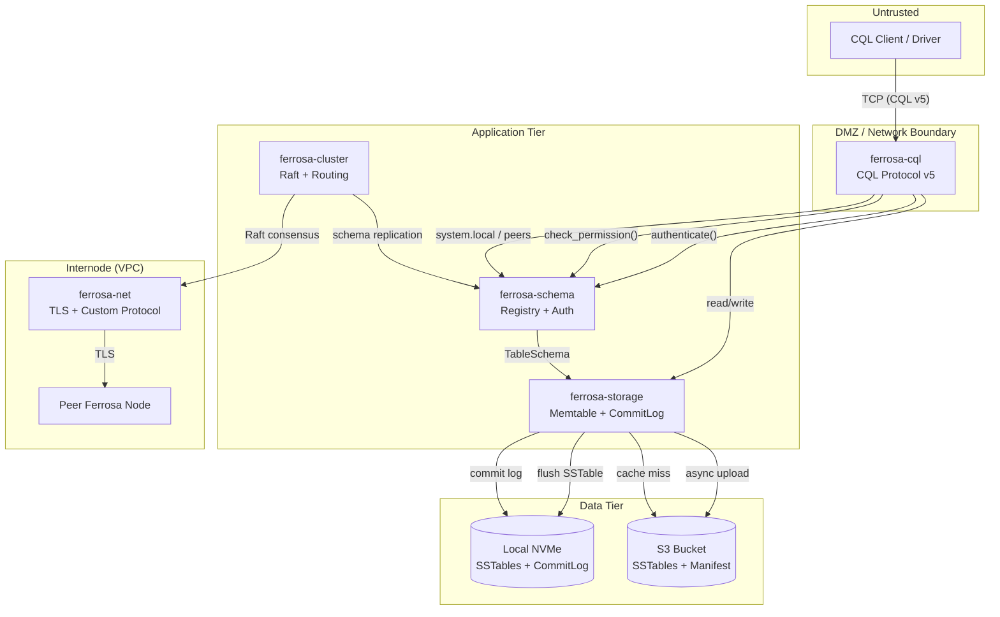

# Ferrosa Threat Model

> Last updated: 2026-03-12
> Status: Draft
> Methodology: STRIDE
> Scope: Full system — focused on ferrosa-schema (Chunk A) with broader system context

## System Overview

Ferrosa is a Rust reimplementation of Apache Cassandra with S3-backed storage. Nodes are ephemeral (local NVMe cache), S3 is the durable source of truth. The system exposes CQL protocol v5 to clients, uses a custom internode protocol with TLS, and communicates with S3 via HTTPS.

**Deployment model**: AWS-first. Nodes in EC2/ECS/EKS, S3 for durability, VPC for internode isolation.

---

## Data Flow Diagram

---

## Assets

| # | Asset | Type | Impact if Compromised |
|---|-------|------|----------------------|
| A1 | User credentials (password hashes) | Confidentiality | Account takeover, privilege escalation |
| A2 | Schema metadata (keyspaces, tables, roles) | Integrity | Data corruption, unauthorized DDL |
| A3 | Data at rest (SSTables in S3) | Confidentiality | Full data breach |
| A4 | Data in transit (CQL, internode) | Confidentiality | Eavesdropping, MITM |
| A5 | Auth tokens / AuthContext | Integrity | Impersonation, privilege escalation |
| A6 | S3 credentials | Confidentiality | Data exfiltration, deletion, tampering |
| A7 | System keyspace responses | Integrity | Topology poisoning, driver misdirection |
| A8 | Commit log segments | Integrity | Data loss, replay attacks |
| A9 | Raft metadata | Integrity | Split-brain, schema divergence |
| A10 | Audit trail | Integrity | Cover tracks after compromise |

---

## Trust Boundaries

| # | Boundary | From | To |
|---|----------|------|----|
| TB1 | Client → CQL | Untrusted network | CQL protocol handler |
| TB2 | CQL → Schema | Protocol layer | Auth + schema registry |
| TB3 | Node → Node | VPC internode | Peer Ferrosa node |
| TB4 | Node → S3 | Application | AWS S3 API |
| TB5 | Node → Local disk | Application | Ephemeral NVMe |
| TB6 | Env vars → Process | OS / container orchestrator | Ferrosa process |

---

## Threat Inventory

### TB1: Client → CQL Protocol (Untrusted Network)

| ID | STRIDE | Threat | Likelihood | Impact | Risk | Status |
|----|--------|--------|-----------|--------|------|--------|
| T01 | **S** | Attacker connects without authenticating and executes queries | 3 | 3 | **9 Critical** | Mitigated by ADR-006: auth required on all operations |
| T02 | **I** | Plaintext CQL traffic intercepted (credentials, query data) | 3 | 3 | **9 Critical** | **Open**: CQL TLS not yet implemented |
| T03 | **T** | MITM modifies CQL frames in transit | 2 | 3 | **6 High** | **Open**: No TLS = no integrity on wire |
| T04 | **D** | Connection flood / query flood exhausts server resources | 3 | 2 | **6 High** | **Open**: No rate limiting or connection limits |
| T05 | **S** | Brute-force password guessing against authenticate() | 3 | 2 | **6 High** | Mitigated: `AuthRateLimiter` with exponential backoff + account lockout in auth module |
| T06 | **I** | Error messages leak role existence or system state | 2 | 1 | **2 Medium** | Mitigated: `AuthenticationFailed` is intentionally vague |

### TB2: CQL → Schema Registry (Auth Boundary)

| ID | STRIDE | Threat | Likelihood | Impact | Risk | Status |
|----|--------|--------|-----------|--------|------|--------|
| T07 | **E** | Non-superuser escalates to superuser via role hierarchy manipulation | 2 | 3 | **6 High** | Mitigated: cycle detection + permission check on GRANT/ALTER ROLE |
| T08 | **E** | Default `cassandra`/`cassandra` superuser credentials left unchanged | 3 | 3 | **9 Critical** | Mitigated: `FERROSA_SUPERUSER_PASSWORD` env var or `must_change_password` flag blocks queries until changed |
| T09 | **T** | Attacker modifies system keyspaces (`system`, `system_auth`, `system_schema`) | 2 | 3 | **6 High** | Mitigated: `SystemKeyspaceProtected` error on user DDL |
| T10 | **I** | Password hashes leaked via system_auth query | 2 | 2 | **4 High** | Mitigated: `query_roles()` filters `salted_hash` to `None` for non-superuser callers |
| T11 | **R** | Admin performs destructive DDL (DROP KEYSPACE) with no audit trail | 2 | 2 | **4 High** | Mitigated: `AuditSink` trait with `LogAuditSink` default — every DDL and auth event emitted (ADR-008) |
| T12 | **T** | Race condition in clone-modify-swap corrupts SchemaSnapshot | 1 | 3 | **3 Medium** | Mitigated: `write_lock: Mutex<()>` serializes all mutations |
| T13 | **E** | Time-of-check-to-time-of-use (TOCTOU): permission checked, then snapshot changes before operation | 1 | 2 | **2 Medium** | Mitigated: permission check and mutation happen under same `write_lock` acquisition |
| T14 | **D** | Expensive password hashing (bcrypt cost 12 / argon2id) used as DoS vector via repeated auth attempts | 2 | 2 | **4 High** | Mitigated: `AuthRateLimiter` checks *before* hashing — throttled/locked requests consume negligible CPU |
| T15 | **I** | `AuthContext` cloned/forged in-process by malicious crate | 1 | 3 | **3 Medium** | Accepted: Rust module system provides boundary; `AuthContext` is `pub` but only constructible via `authenticate()` |

### TB3: Internode Communication (VPC)

| ID | STRIDE | Threat | Likelihood | Impact | Risk | Status |
|----|--------|--------|-----------|--------|------|--------|
| T16 | **S** | Rogue node joins cluster and participates in Raft consensus | 2 | 3 | **6 High** | **Open**: Internode auth not yet implemented (TLS planned, mutual TLS needed) |
| T17 | **I** | Internode traffic intercepted within VPC (lateral movement after compromise) | 1 | 3 | **3 Medium** | **Open**: TLS specified but not implemented |
| T18 | **T** | Malicious Raft proposal alters schema on all nodes | 1 | 3 | **3 Medium** | Mitigated (future): Raft proposals go through auth-gated Schema API |

### TB4: Node → S3 (Object Storage)

| ID | STRIDE | Threat | Likelihood | Impact | Risk | Status |
|----|--------|--------|-----------|--------|------|--------|
| T19 | **I** | SSTable data readable by anyone with S3 bucket access (no envelope encryption) | 2 | 3 | **6 High** | Partial: relies on S3 SSE-KMS/SSE-S3 bucket policy; no application-level encryption |
| T20 | **T** | Attacker with S3 write access tampers with SSTable or manifest | 1 | 3 | **3 Medium** | Partial: etag-based CAS for manifest; no integrity verification on SSTable reads |
| T21 | **S** | S3 credentials (access key / secret key) leaked from environment | 2 | 3 | **6 High** | Partial: EC2 instance profiles preferred; env vars still supported |
| T22 | **D** | S3 bucket deleted or lifecycle policy misconfigured, losing all durable data | 1 | 3 | **3 Medium** | **Open**: No S3 bucket policy validation or backup strategy |
| T23 | **T** | Manifest CAS conflict causes lost SSTable references (data unreachable) | 2 | 2 | **4 High** | **Open**: CAS retry loop not yet wired |

### TB5: Node → Local Disk (Ephemeral)

| ID | STRIDE | Threat | Likelihood | Impact | Risk | Status |
|----|--------|--------|-----------|--------|------|--------|
| T24 | **I** | Local SSTables and commit log readable by co-tenant on shared host / surviving on EBS volumes | 2 | 2 | **4 High** | Mitigated: startup check warns if data directory is not on an encrypted filesystem; encrypted EBS/LUKS documented as deployment prerequisite |
| T25 | **T** | Commit log segments corrupted on disk | 2 | 2 | **4 High** | Mitigated: CRC32 checksums on commit log entries; corruption detected at replay |

### TB6: Environment / Configuration

| ID | STRIDE | Threat | Likelihood | Impact | Risk | Status |
|----|--------|--------|-----------|--------|------|--------|
| T26 | **I** | Environment variables (`FERROSA_AUTH_*`, `FERROSA_S3_*`) exposed via /proc, container inspection, or logging | 2 | 2 | **4 High** | Mitigated: `SecretsProvider` trait (ADR-009) — `EnvSecretsProvider` default, pluggable AWS Secrets Manager/Vault/file backends |
| T27 | **T** | Attacker sets `FERROSA_AUTH_BCRYPT_COST=4` to weaken password hashing | 1 | 2 | **2 Medium** | Accepted: requires host access; cost floor of 4 is Rust bcrypt crate minimum |
| T28 | **T** | `FERROSA_S3_ALLOW_HTTP=true` enables unencrypted S3 traffic in production | 2 | 2 | **4 High** | Mitigated: `FERROSA_MODE=production` rejects `FERROSA_S3_ALLOW_HTTP=true` at startup (ADR-010) |

---

## Risk Summary

### Critical (Risk 9) — Must mitigate before production

| ID | Threat | Mitigation |
|----|--------|-----------|
| T02 | Plaintext CQL traffic | Implement CQL TLS (rustls). Default to TLS-required in production. |
| T08 | Default superuser unchanged | Mitigated: `FERROSA_SUPERUSER_PASSWORD` env var at bootstrap; without it, `must_change_password` flag blocks queries until password is changed. |

### High (Risk 4-6) — Mitigate in current release cycle

| ID | Threat | Mitigation |
|----|--------|-----------|
| T03 | CQL MITM | Solved by T02's TLS implementation. |
| T04 | Connection/query flood | Add configurable connection limits and per-IP rate limiting in ferrosa-cql. |
| T05 | Auth brute-force | Mitigated: `AuthRateLimiter` in schema crate with exponential backoff + account lockout. |
| T07 | Privilege escalation via role hierarchy | Already mitigated by cycle detection + auth checks on grant/revoke. Verify in tests. |
| T09 | System keyspace modification | Already mitigated. Verify in tests. |
| T10 | Password hash exposure | Mitigated: `query_roles()` filters `salted_hash` to `None` for non-superuser callers. |
| T11 | No audit trail | Mitigated: `AuditSink` trait with `LogAuditSink` in Chunk A (ADR-008). System table sink in Chunk F. |
| T14 | Auth DoS via hashing cost | Mitigated: rate limiter checks *before* hashing; CQL layer adds per-IP throttle. |
| T16 | Rogue node joins cluster | Implement mutual TLS for internode with certificate pinning or shared CA. |
| T19 | S3 data unencrypted at app level | Document SSE-KMS requirement. Startup check verifies bucket encryption is enabled. Envelope encryption deferred to hardening phase. |
| T21 | S3 credential leak | Prefer instance profiles. Document: never use long-lived access keys in production. |
| T23 | Manifest CAS conflict | Wire the retry loop (already designed, not connected). |
| T25 | Commit log corruption | Already mitigated by CRC32. Verify replay rejects corrupt entries in tests. |
| T26 | Env var secrets exposure | Mitigated: `SecretsProvider` trait with pluggable backends (ADR-009). |
| T28 | HTTP S3 in production | Mitigated: production mode rejects `FERROSA_S3_ALLOW_HTTP=true` at startup (ADR-010). |

### Medium (Risk 2-3) — Accept or plan

| ID | Threat | Status |
|----|--------|--------|
| T06 | Auth error leakage | Mitigated by design. |
| T12 | Snapshot race | Mitigated by `write_lock`. |
| T13 | TOCTOU | Mitigated by lock scope. |
| T15 | In-process AuthContext forgery | Accepted (Rust module boundary). |
| T17 | Internode eavesdropping | Planned (TLS). |
| T18 | Malicious Raft proposal | Mitigated by auth-gated API. |
| T20 | S3 SSTable tampering | Partial (etag CAS). Future: checksum verification on read. |
| T22 | S3 bucket deletion | Document ops procedure: versioning + MFA delete on bucket. |
| T24 | Local disk co-tenant / shared volumes | Mitigated: startup encryption check + deployment docs. |
| T27 | Weakened hash cost | Accepted (requires host access). |

---

## Mitigations by Priority

### Phase 1: Included in ferrosa-schema Chunk A

| Mitigation | Threats | Effort | Status |
|-----------|---------|--------|--------|
| `FERROSA_SUPERUSER_PASSWORD` env var + `must_change_password` flag | T08 | Small | Designed |
| `query_roles()` filters `salted_hash` for non-superusers | T10 | Small | Designed |
| `AuthRateLimiter` with exponential backoff + account lockout | T05, T14 | Medium | Designed |
| Startup check: warn if data dir not on encrypted filesystem | T24 | Small | Designed |
| `AuditSink` trait + `LogAuditSink` — structured JSON audit via tracing | T11 | Medium | Designed (ADR-008) |
| `SecretsProvider` trait + `EnvSecretsProvider` — pluggable secrets backend | T26 | Medium | Designed (ADR-009) |
| Production mode — `FERROSA_MODE=production` enforces TLS, encryption, no defaults | T02, T16, T24, T28 | Medium | Designed (ADR-010) |

### Phase 2: Before production (ferrosa-cql + ferrosa-net)

| Mitigation | Threats | Effort |
|-----------|---------|--------|
| CQL TLS via rustls (default: required) | T02, T03 | Medium |
| Connection limits + per-IP rate limiting | T04 | Medium |
| Internode mutual TLS | T16, T17 | Medium |
| Audit: system table sink (`system_auth.audit_log`) | T11 | Medium |

### Phase 3: Hardening

| Mitigation | Threats | Effort |
|-----------|---------|--------|
| Secrets manager concrete providers (AWS SM, Vault, file) | T21 | Medium |
| S3 bucket policy validation at startup | T22, T28 | Small |
| Manifest CAS retry loop | T23 | Small (designed, needs wiring) |
| SSTable read-time checksum verification | T20 | Medium |
| Envelope encryption for sensitive data | T19 | Large |

---

## Assumptions

1. **Network**: Internode traffic is within a VPC; CQL port may be exposed to untrusted networks
1. **S3**: Bucket has SSE-S3 or SSE-KMS enabled; bucket policy restricts access to Ferrosa IAM roles
1. **Host**: Ferrosa data directory is on an encrypted filesystem (encrypted EBS, LUKS, or dm-crypt). Startup warns if not detected. Shared/persistent volumes (EBS) must be encrypted to prevent data exposure on volume reattach.
1. **Rust safety**: Memory safety vulnerabilities (buffer overflows, use-after-free) are not a primary concern due to Rust's type system; `unsafe` blocks are reviewed
1. **Dependencies**: Third-party crates (`bcrypt`, `argon2`, `arc-swap`, `object_store`) are maintained and free of known vulnerabilities at time of integration
1. **Operator**: Operators follow documented security practices (change default password, enable TLS, use instance profiles)

## Open Questions

- [x] ~~Should ferrosa-schema enforce a minimum password complexity policy?~~ **Resolved**: Yes. `PasswordPolicy` struct with `iso27001()` preset enforced as floor in production mode.
- [x] ~~Should `authenticate()` rate limiting live in the schema crate or the CQL protocol layer?~~ **Resolved**: Both. Per-username rate limiting with backoff in schema crate (`AuthRateLimiter`); per-IP rate limiting in CQL layer (future).
- [x] ~~What is the audit log format and destination?~~ **Resolved**: Both. `LogAuditSink` (structured JSON via tracing) + `SystemTableAuditSink` (in-memory ring buffer queryable as `system_auth.audit_log`). S3 archival sink is follow-on.
- [x] ~~Should we support client certificate authentication (mutual TLS)?~~ **Resolved**: Yes. `AuthMethod` enum: `Password`, `Certificate`, `CertificateAndPassword`. Production mode requires mutual TLS on both CQL and internode. Config designed in Chunk A, implemented in ferrosa-cql/ferrosa-net.
- [ ] Do we need S3 object-level integrity verification (SHA-256 checksum on upload, verify on read) or is S3's built-in integrity sufficient?
- [x] ~~Should `FERROSA_S3_ALLOW_HTTP` be gated behind a `FERROSA_ENV=development` check?~~ **Resolved**: Yes. `FERROSA_MODE=production` rejects it at startup (ADR-010).
- [x] ~~Should we force superuser password change at bootstrap?~~ **Resolved**: Yes. `FERROSA_SUPERUSER_PASSWORD` env var or `must_change_password` flag.
- [x] ~~Should `salted_hash` be filtered from non-superuser queries?~~ **Resolved**: Yes. `query_roles()` returns `None` for non-superusers.
- [x] ~~Should local disk encryption be required?~~ **Resolved**: Yes. Encrypted EBS/LUKS is a deployment prerequisite; startup check warns if not detected.
