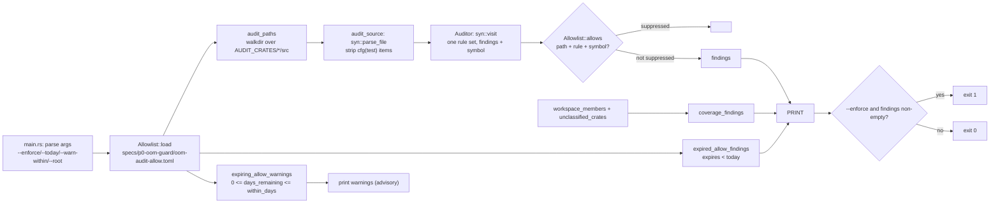

# xtask — overview

`xtask` is the repo's automation binary (`publish = false`, no library target).
It currently hosts exactly one subcommand, `p0-oom-audit`: the static AST layer
of the P0 OOM guard. See [`../../specs/p0-oom-guard/blueprint.md`](../../specs/p0-oom-guard/blueprint.md)
for the guard as a whole and [`../README.md`](../README.md) for the CLI contract.

## Architecture

`p0-oom-audit` is a pipeline of small pure functions, with all IO at the edges
so every rule is unit-testable without touching disk.

Two properties are load-bearing:

* **Detection is AST-based, never text.** Decision D2 in the blueprint: a
  source-grep test is precisely what certified the original materialization bug.
  Every rule inspects parsed syntax via `syn::visit`.
* **Dates are evaluated, not guessed.** `--today` is passed in by the CLI; lib
  code never reads the system clock, so a rule outcome is reproducible. Expiry
  comparisons use real calendar arithmetic (`days_since_epoch`), and the
  historical lexicographic compare is pinned by a test to agree with it on every
  shipped allow entry.

## The two halves of the expiry contract

| | Condition | Reported as | Affects exit code |
|---|---|---|---|
| Expired | `expires < today` | finding `expired-allow-entry` | **yes** (under `--enforce`) |
| Expiring soon | `0 <= expires - today <= --warn-within` | warning `expiring-allow-entry` | no |
| Malformed | `expires` is not a real `YYYY-MM-DD` | warning `unparseable-allow-expiry` | no |

An entry expiring **today** is a warning (`days_remaining == 0`); the failure
starts the next day. An entry can never be both.

The split exists because the failure half alone lets a date-triggered failure
arrive with no notice: on 2026-10-01 nine entries dated 2026-09-30 expired
together and made `main` red on its next push, in an unrelated PR. Warnings are
what make the approach visible while it can still be acted on.

## Coverage policy

Audit coverage is exhaustive by default. Every workspace member is either in
`AUDIT_CRATES` (scanned) or in `NON_SERVING_CRATES` with the reason it owns no
query-sized serving path. A member in neither produces an `unclassified-crate`
finding, so a newly added crate fails the audit instead of silently widening the
blind spot. An unreadable workspace manifest is itself a finding — unknown
coverage must never read as a clean run.
